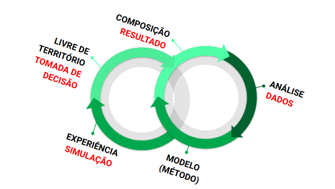

# Music Analysis: Analysis Support and Validator Tool

This project refers to a paper accepted for publication at the III Congress of the Brazilian Association of Music Theory and Analysis (TeMA) and the IV International Congress of Music and Mathematics (MusMat).

Over-analysis of John Cage's movement, we proposed a general method to support musical analysis, research and teaching.
The method uses a statistical learning approach that uses the Markov Theory and the Monte-Carlo Algorithm.

Paper available at: **NOT AVAILABLE YET**
